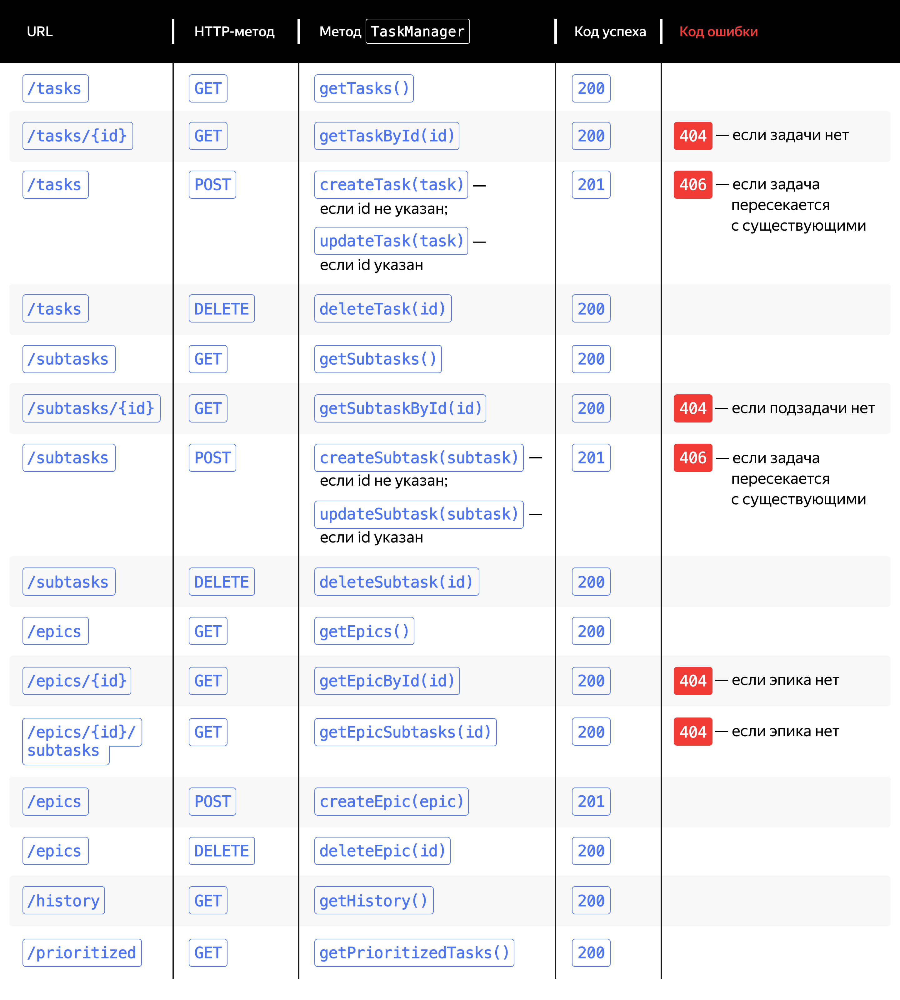

Ваша задача — реализовать API, в котором эндпоинты будут соответствовать вызовам базовых методов интерфейса TaskManager. 
Например, вызову метода `getTasks()` будет соответствовать эндпоинт GET /tasks. 
Такое соответствие эндпоинтов и методов называют маппингом (от англ. mapping).
Все методы `TaskManager` можно разделить на пять групп. 
Это методы для работы с обычными задачами, подзадачами, эпиками, а также с историей и списком задач в порядке приоритета.

Каждой группе в API должен соответствовать свой путь — так интерфейс будет максимально удобным и понятным для пользователя.
Следовательно, базовые пути приложения будут следующие:
**/tasks**, **/subtasks**, **/epics**, **/history** и **/prioritized**.
Для выполнения разных операций с данными для одного и того же пути используют разные HTTP-методы.
Так, для запросов на чтение данных (например, для получения списка задач) используют метод GET, 
для модификации данных (например, для добавления новой задачи или изменения существующей) — POST, 
а для удаления данных (например, для удаления задачи) — DELETE.

Не забудьте о статусах ответа, которые сервер будет возвращать пользователю. Начнём с кодов успеха:
- если сервер корректно выполнил запрос и вернул данные — код 200;
- если запрос выполнен успешно, но возвращать данные нет необходимости (так бывает в запросах на их модификацию) — код 201.

На случай проблем с запросами пользователя пригодятся коды ошибок — их будет три:
- если пользователь обратился к несуществующему ресурсу (например, попытался получить задачу, которой нет) — 
статус 404 (Not Found);
- если добавляемая задача пересекается с существующими — статус 406 (Not Acceptable);
- если произошла ошибка при обработке запроса (например, при сохранении данных менеджера в файл) — 
статус 500 (Internal Server Error).

Осталось определить формат, в котором данные будут передаваться между клиентом и сервером. 
Стандартным считается формат JSON — используйте его.
Подведём итог и опишем ожидаемый API в виде таблицы.

# Продумываем реализацию

Теперь, когда вы определились с API, можно переходить к его реализации. 
Вот что нужно сделать:
1. Создайте класс HttpTaskServer — он будет слушать порт $8080$ и принимать запросы. 
Это будет основной класс вашего приложения. 
В нём должен находиться метод main, 
который будет запускаться для начала работы с программой. 
2. Чтобы приложение могло принимать и обрабатывать запросы пользователя, 
используйте класс HttpServer. 
При запуске программы должен стартовать экземпляр HttpServer. 
3. Для каждого из пяти базовых путей создайте свой обработчик. 
Затем привяжите его к соответствующему пути. 
4. Добавьте в проект библиотеку Gson для работы с JSON. 
Она пригодится в обработчиках для парсинга данных пользователя. 
И наоборот — для возвращения пользователю результатов запроса. 
5. Добавьте в сервер работу с менеджером задач. 
Используйте утилитарный класс Managers, чтобы получить экземпляр менеджера. 
Учтите, что в обработчиках должен быть доступ к этому экземпляру — подумайте, 
как это лучше реализовать. 
6. В обработчиках реализуйте обработку запросов пользователя, 
а также обращение к соответствующим методам менеджера задач согласно спецификации. 
7. Убедитесь, что API приложения функционирует корректно. Для проверки используйте инструменты Insomnia или Postman. 
Принципы работы с этими программами схожи, так что, если вы знаете, как использовать одну, 
вам не составит труда освоить другую.

# Пишем тесты

Осталось реализовать unit-тесты для разработанного HTTP-интерфейса. Можно использовать следующий алгоритм для каждого теста:
1. Создайте экземпляр HttpTaskServer и запустите HTTP-сервер. 
Подумайте, как лучше спроектировать класс HttpTaskServer, 
чтобы сервер было удобно запускать как конечному пользователю, так и для тестирования.
2. Выполните HTTP-запрос к серверу. Для этого понадобится класс HttpClient.
3. Выполните проверки. 
В зависимости от задачи они могут быть разными — например, 
убедиться, что добавленная задача успешно сохранилась в менеджере.
4. Остановите HTTP-сервер. 
Это важно: если сервер не остановить, его будет невозможно запустить ещё раз на том же порту.

Так как код запуска и остановки сервера будет дублироваться в каждом тесте, 
этот код можно вынести в отдельные методы и пометить их аннотациями @BeforeEach и @AfterEach.
Напишите тесты для каждого эндпоинта HttpTaskServer. 
Обязательно проверьте в каждом из тестов статус ответа — отдельно для успешного и неуспешного сценариев.
Чтобы с кодом тестов было проще работать, мы рекомендуем разбить их на несколько классов — для каждого из базовых путей.